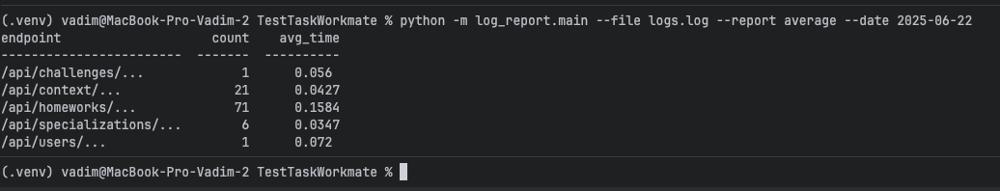

# Log Report Generator

A command-line tool for analyzing structured JSON log files and generating tabular reports.

## Features

- Supports multiple input log files
- Generates reports by endpoint with request count and average response time
- Optional filtering by date (`--date YYYY-MM-DD`)
- Clean tabular output using `tabulate`
- Modular architecture for easily adding new report types
- Includes pre-commit hooks for code quality

## Requirements

- Python 3.12+
- Install dependencies:

```bash
pip install -r requirements.txt
```
## Usage example
```bash
python main.py --file logs/api.log --report average --date 2025-06-22
```
## Example 1


## Example 2

